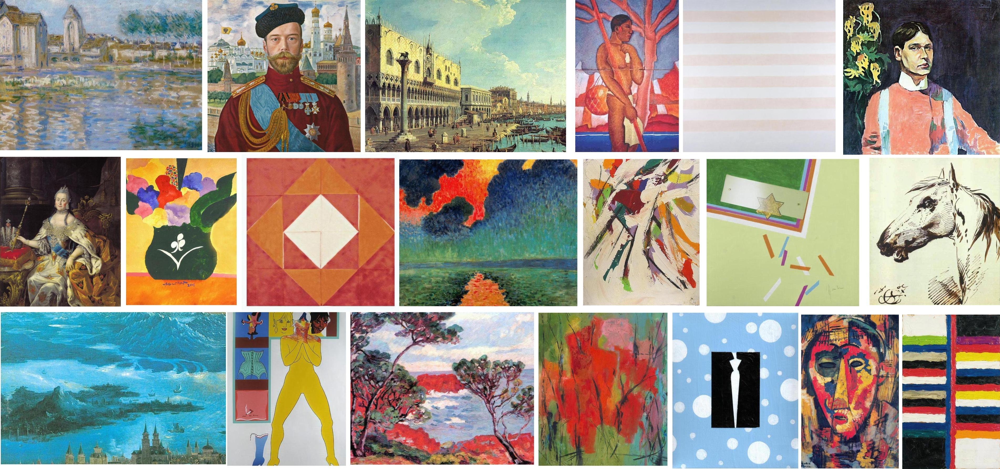
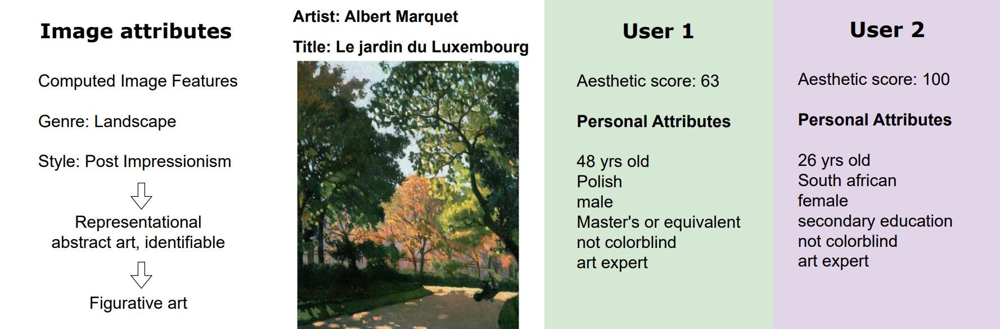

# The Leuven Art Personalized Image Set (LAPIS)
Dataset from "LAPIS: a novel dataset for personalized image aesthetic assessment".
Accepted at [CVEU](https://cveu.github.io/), a workshop of CVPR 2025.

## Why LAPIS?
1. LAPIS is the **first** dataset with art images that is suitable for personalized image aesthetic assessment(PIAA)
2. LAPIS contains **rich** image and personal attributes to improve (understanding of) predictions
4. LAPIS establishes a new standard for **data-quality** in the field, as it was meticulously curated in collaboration with art historians



Visualisation of the types of data in LAPIS. All images have metadata (title, artist) and image attributes. Images are rated by multiple users on their aesthetic appeal. For each user, we have a set of personal attributes

## Want to download LAPIS?
You can request access to the dataset [here]()

## 📖 Cite Us
If you use our data, you can cite our work with the following citation:
```bibtex
@Inproceedings{Maerten2025LAPIS,
  title = {LAPIS: a novel dataset for personalized image aesthetic assessment},
  author = {Anne-Sofie Maerten and Li-Wei Chen and Stefanie De Winter and Christophe Bossens and Johan Wagemans},
  booktitle = {Proceedings of the IEEE/CVF Conference on Computer Vision and Pattern Recognition (CVPR), workshops},
  year = {2025},
}
```

## Acknowledgments
This research was funded by the European Union (ERC AdG, GRAPPA, 101053925, awarded to Johan Wagemans) and the Research Foundation-Flanders (FWO, 11C9522N, awarded to Anne-Sofie Maerten).

